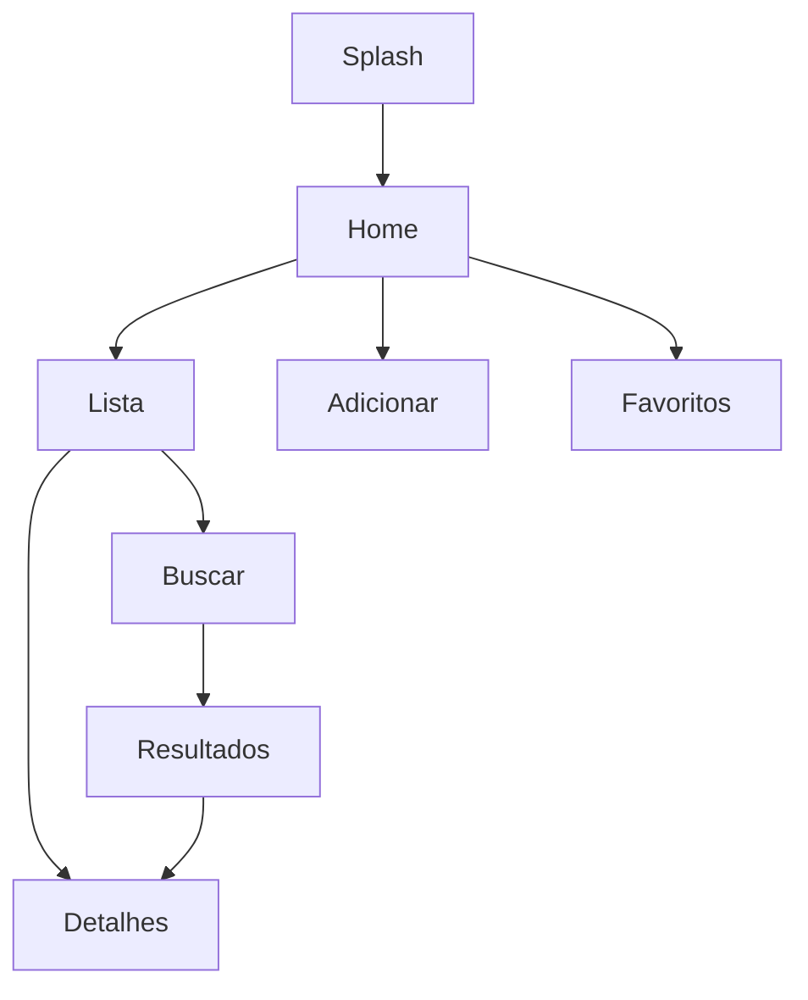

# README - PeripheralCatalog

## Integrantes
- Yasmin Faraj
- Felipe Uemura

## Sobre o Projeto
O PeripheralCatalog é um aplicativo Android desenvolvido em Kotlin, utilizando
arquitetura MVVM, Jetpack Compose para a interface e Room para
armazenamento local. O aplicativo permite cadastrar, listar, consultar e
excluir periféricos, com integração opcional a uma API via Retrofit.

## Como Executar
1.  Abra o projeto no Android Studio.
2.  Aguarde o Gradle sincronizar.
3.  Execute em um dispositivo físico ou emulador.
4.  O banco de dados é criado automaticamente pelo Room.

## Endpoints
O projeto utiliza uma requisição simples: - `GET /peripherals` — lista periféricos.
Retorna uma lista de periféricos contendo id, name, brand e type.

## Diagrama de Navegação

MainActivity\
→ Lista de Periféricos\
→ Adicionar Periférico\
→ Detalhes do Periférico

### ASCII
```
[Splash] -> [Home]
[Home] -> [Lista]
[Home] -> [Adicionar]
[Lista] -> [Detalhes]
[Lista] -> [Buscar]
[Buscar] -> [Resultados] -> [Detalhes]
[Home] -> [Favoritos]
```

### Mermaid


## Banco de Dados (Room)

## Estrutura do Banco de Dados

Tabela: PeripheralEntity\
Campos: - id (Primary Key) - name - brand - type

```
PeripheralEntity
- id: Long
- name: String
- brand: String
- type: String
- isFavorite: Boolean
```

DAO:
```
insert()
update()
delete()
getAll()
findById()
search()
```

## Funcionalidades

-   Listar periféricos
-   Adicionar periféricos
-   Excluir periféricos
-   Persistência local
-   Consumo de API
-   Interface em Compose

## Estrutura
- MVVM
- Jetpack Compose
- Room
- Repository

## Trabalho em Equipe e Contribuições

### Yasmin Faraj

-   Camada ViewModel
-   Interface com Compose
-   Integração com o Repository
-   Documentação

### Felipe Uemura

-   Configuração do Room Database
-   Criação das entidades e DAO
-   Estruturação do Retrofit
-   Modelos e DTOs
-   Ajustes na arquitetura